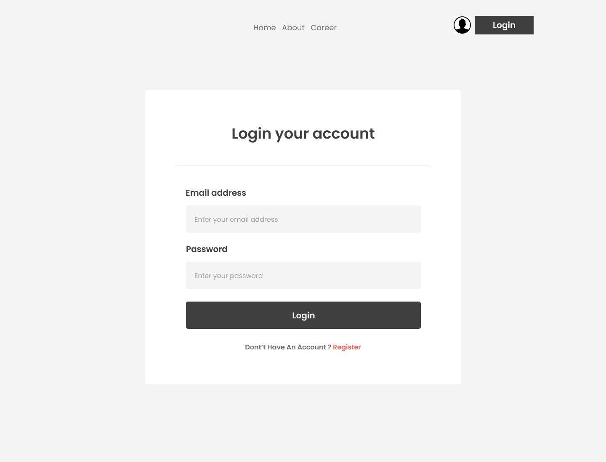
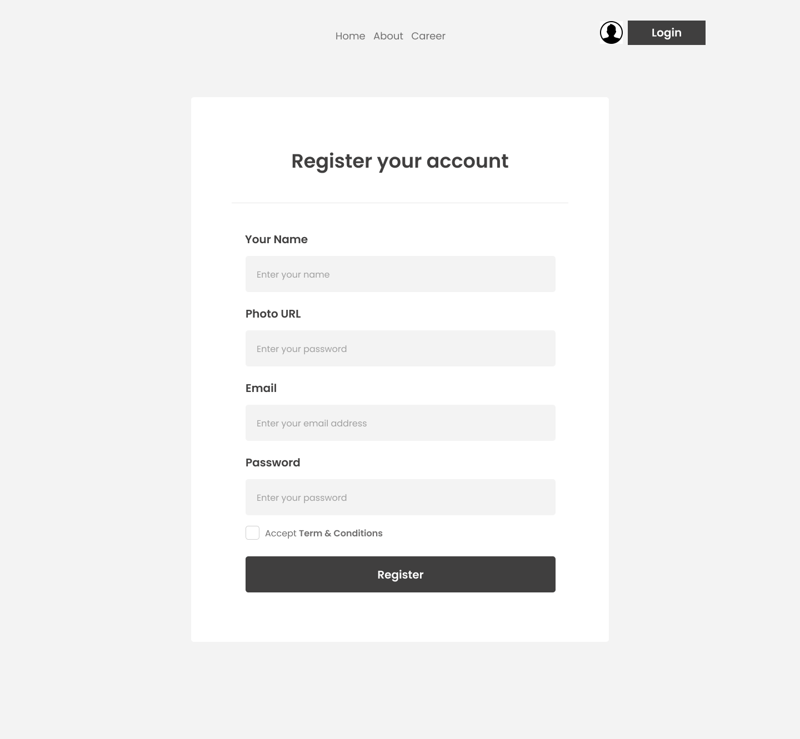
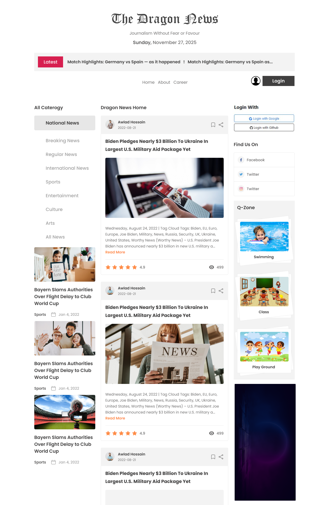
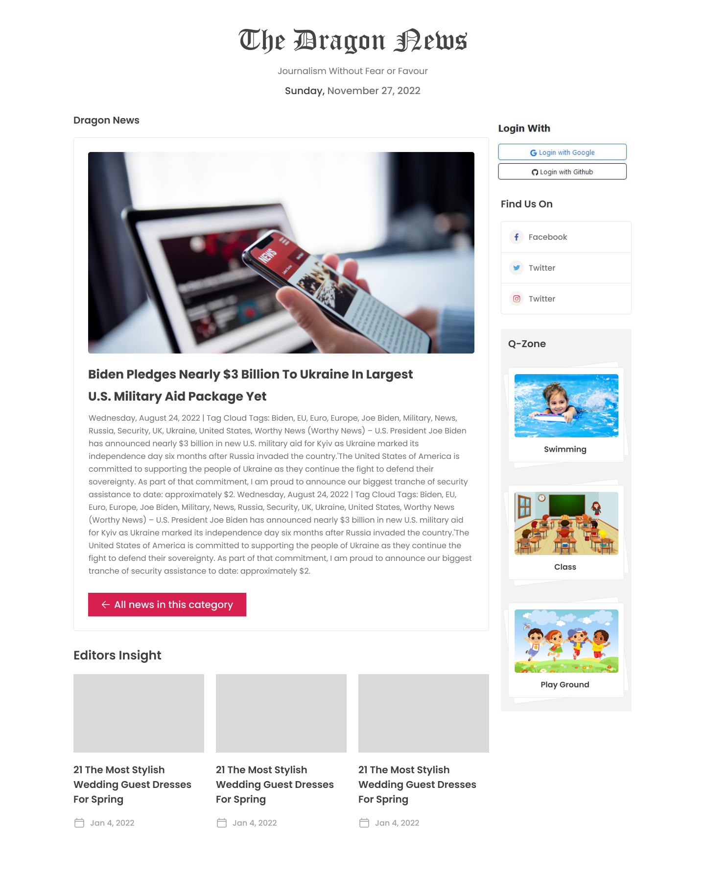

# 🐉 Dragon News

### A Modern, Fast & Secure News Platform

Stay informed with real-time news across categories — built for speed, security, and a seamless experience on every device.

---

## 📖 Overview

**Dragon News** is a modern news platform built with **Next.js** and **React**, offering category‑based browsing and secure authentication via **Better Auth** (Email, Google, GitHub). It uses **Next.js Route Groups** for clean routing and delivers a fast, responsive reading experience across all devices.

---

## ✨ Features

- 📰 Category‑based browsing
- 🔐 Secure authentication (Email, Google, GitHub)
- ⚡ Optimized performance with Next.js
- 📱 Fully responsive design
- 🗂️ Organized routing using Route Groups
- 🔎 Detailed article view
- 🎨 Modern UI with TailwindCSS, DaisyUI, HeroUI

---

## 🛠️ Tech Stack

- **Framework**: Next.js
- **UI Library**: React
- **Authentication**: Better Auth
- **Styling**: Tailwind CSS, DaisyUI, HeroUI
- **API**: Programming Hero Open API
- **Deployment**: Vercel / Render

---

## 🔌 API Reference

Base URL: `https://openapi.programming-hero.com/api`

- **Get All Categories** → `/news/categories`
- **Get News by Category** → `/news/category/{category_id}`
- **Get News Detail** → `/news/{news_id}`

---

## 🖼️ Layout Previews

### 🔐 Authentication Layouts

<table>
  <tr>
    <td align="center">
      <b>Login Page</b> 
      
    </td>
    <td align="center">
      <b>Register Page</b> 
      
    </td>
  </tr>
</table>

---

### 🏠 Home Layout

<table>
  <tr>
    <td align="center">
      <b>Homepage</b> 
      
    </td>
  </tr>
</table>

---

### 📰 News Details Layout

<table>
  <tr>
    <td align="center">
      <b>Article Details Page</b> 
      
    </td>
  </tr>
</table>

---

Made with ❤️ and lots of ☕

